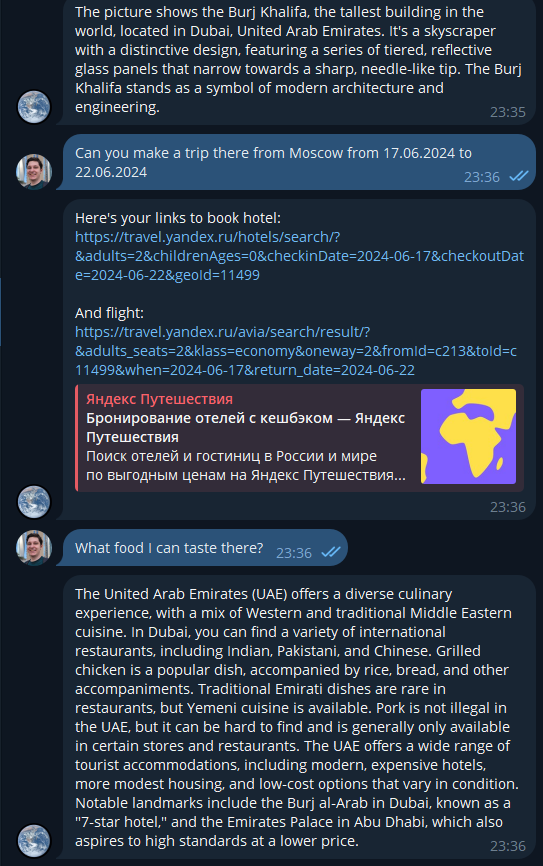
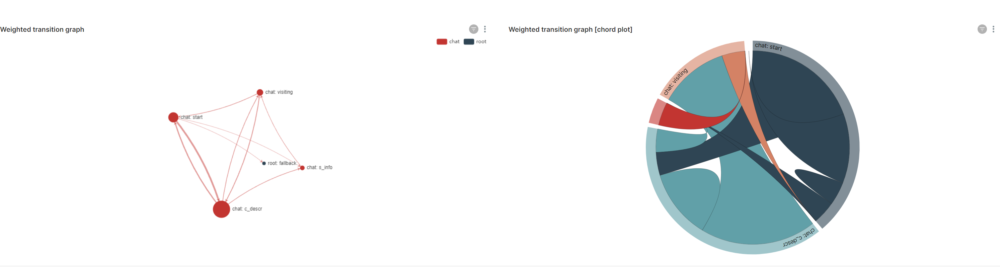

# TravelTime!

In this project we developing Traveler AI Assistant, which is capable of using user's images and text to answer any travel question. We use Dialogue Flow Framework to make dialogue graph and conversation via Telegram bot, LLaVA as backbone LLM, which is using some kind of RAG, and OpenTelemetry stack to store statistics. Example screenshots are below and <a href="https://disk.yandex.ru/i/x3igLT4Inel0zQ">here</a>




<a href="https://disk.yandex.ru/d/GIJNihL1EvOuvw">More info.</a>

## How to use it

### Clone the repo:
Choose any dir and do:

```shell
git clone https://github.com/pavviaz/itmo_convai_course.git
cd itmo_convai_course
```

### Create `.env` file

Create `.env` with following keys:

```
NEURAL_API_PORT=7875
WORKER_PORT=7870

TG_BOT_TOKEN=<your_token>

NVIDIA_VISIBLE_DEVICES=<GPU>

# You can use it to pass local saved weights to neural worker container
TRANSFORMERS_CACHE=/cache/

MYSQL_USERNAME=root
MYSQL_PASSWORD=pass
MYSQL_ROOT_PASSWORD=pass
MYSQL_DATABASE=test
POSTGRES_USERNAME=postgres
POSTGRES_PASSWORD=pass
POSTGRES_DB=test
REDIS_PASSWORD=pass
MONGO_INITDB_ROOT_USERNAME=admin
MONGO_INITDB_ROOT_PASSWORD=pass
GRPC_TLS_PORT=2135
GRPC_PORT=2136
MON_PORT=8765
YDB_ENDPOINT=grpc://localhost:2136
YDB_DATABASE=/local
YDB_ANONYMOUS_CREDENTIALS=1
CLICKHOUSE_DB=test
CLICKHOUSE_USER=username
CLICKHOUSE_DEFAULT_ACCESS_MANAGEMENT=1
CLICKHOUSE_PASSWORD=pass
SUPERSET_USERNAME=superset
SUPERSET_PASSWORD=superset
SUPERSET_METADATA_PORT=5433
```

### Build & run

Use docker-container like this:
```shell
sudo docker-compose build
sudo docker-compose up
```

Congratulations, now your bot is up!

### OpenTelemetry

To obtain OpenTelemetry statistics, you should install `dff[stats]` first:
```
python3 -m pip install dff[stats]
```

Then use this configure web API, use this:
```
dff.stats dff_api/stat_conf.yaml -P superset -dP pass -U superset --outfile=config_artifact.zip
```
Now you can access web API on `http://localhost:8088/` with `superset` as login and password.

Note, that port `8088` must be forwarded from the `dashboard` container!



## Details

1) The fisrt launch can be really slow, because Huggingface will download `llava-hf/llava-v1.6-mistral-7b-hf` weights, which is around 15GB;
2) Testing is being performed on every startup via `check_happy_path` function;
3) We implemented RAG with `neural_api/rag_data/rag.csv`. We have only UAE, France, UK, Thailand, Turkey, USA, Italy written there, so if user asks about one of this country, the RAG will be used. Otherwise, LLM will only use it's own knowladge;
4) We have 3 main dialogue nodes: `s_info` is used for sights on images description; `c_descr` is used for any question about the country (and will use RAG if possible); `visiting` will try to extract both from-to cities and dates and create Yandex.Traveling links to book a hotel and buy flight tickets.

## Built With
- <a href="https://deeppavlov.github.io/dialog_flow_framework/index.html">DFF</a>
- <a href="https://github.com/haotian-liu/LLaVA?tab=readme-ov-file">LLaVA</a>
- <a href="https://fastapi.tiangolo.com/">FastAPI</a>

## Authors
- Вязников Павел @pavviaz
- Лаврентьев Василий @lavrentyevvu
